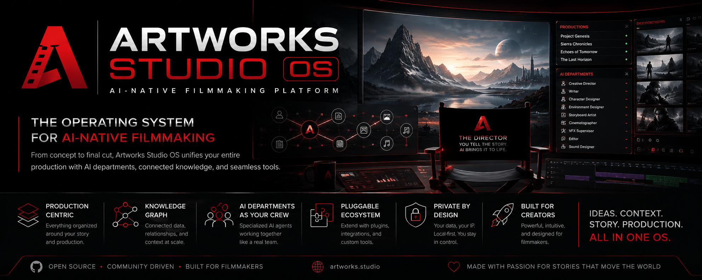

<p align="center">
  
</p>

# 🎬 Artworks Studio OS

<p align="center">
<h3 align="center">The Operating System for AI‑Native Filmmaking</h3>
<p align="center"><b>Create Stories. Build Worlds. Direct Intelligence.</b></p>
</p>

---

## We Are Not Building Another AI Application

Artworks Studio OS is a production operating system built specifically for filmmakers.

Instead of combining disconnected AI tools, it unifies the complete filmmaking lifecycle into one intelligent production environment.

From the first spark of an idea to the final exported film, every creative decision, production asset, AI interaction, document, and revision lives inside a single production ecosystem.

## Why It Exists

Today's AI filmmaking workflow is fragmented.

Writers use chatbots.
Artists use image generators.
Animators use video generators.
Teams maintain documentation elsewhere.
Assets become duplicated.
Characters drift.
Continuity breaks.

Artworks Studio OS replaces fragmented workflows with a connected production platform.

---

# Production Workflow

Idea → Story Bible → World Building → Characters → Storyboards → AI Production → Assets → Animation → VFX → Editorial → Publishing

---

# Core Pillars

- 🎭 Story First
- 🎬 Production Before Generation
- 🤖 AI as Specialized Departments
- 🧠 Knowledge Graph
- 🔄 Single Source of Truth
- 📚 Production Documentation
- ⚡ Intelligent Automation
- 🔌 Plugin Ecosystem
- 🌍 Local First

---

# AI Departments

Instead of one assistant, Artworks Studio OS provides an entire production crew.

- Creative Director
- Writer
- Production Manager
- Character Designer
- Environment Designer
- Storyboard Artist
- Prompt Director
- Cinematographer
- Animator
- VFX Supervisor
- Editor
- Publisher

AI is the crew.
The filmmaker remains the director.

---

# Planned Architecture

Production Engine
├── Knowledge Graph
├── Production Context Engine
├── Documentation
├── Asset Library
├── AI Orchestration
├── Git Integration
└── Plugin SDK

---

# Roadmap

✅ Foundation
- Project Management
- Documentation
- Git
- Asset Management

🚧 Knowledge Graph

🚧 Visual Production Pipeline

🚧 AI Production Automation

🚧 Collaborative Cloud Studio

---

# Repository Structure

```text
/docs       — architecture, database, plugin SDK, design system, PRD, roadmap
/src        — Electron app (main / preload / renderer / shared)
/aw         — Python CLI sidecar (workspace + production operations)
/plugins    — reference plugins (example-hello)
/assets     — branding, banners
/tests      — (per-module test files live alongside source)
```

---

# Guiding Philosophy

Technology exists to serve storytelling.

The operating system translates artistic intent into technical execution.

Creativity stays human.
AI handles production.

---

# Contributing

Every pull request should answer one question:

> Will this make filmmaking more creative, more organized, and more human?

If the answer is yes, build it.

---

# Vision

To become the world's leading operating system for AI-native filmmaking, enabling creators everywhere to build feature-quality cinematic productions through structured workflows, connected knowledge, and intelligent automation.

---

# Motto

**Create Stories. Build Worlds. Direct Intelligence.**
